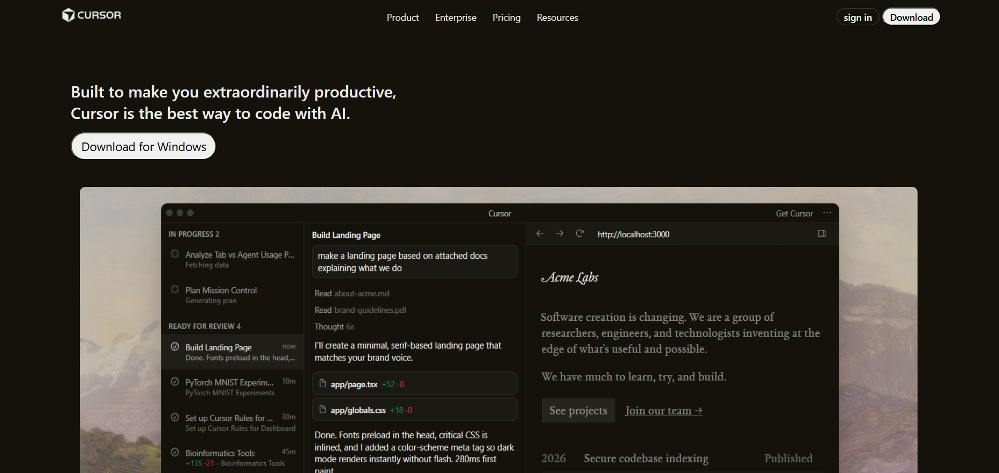
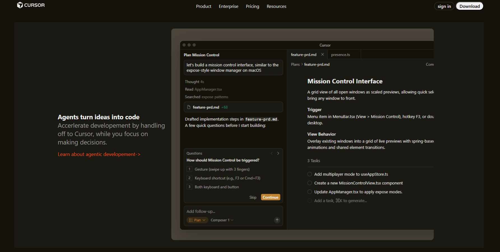
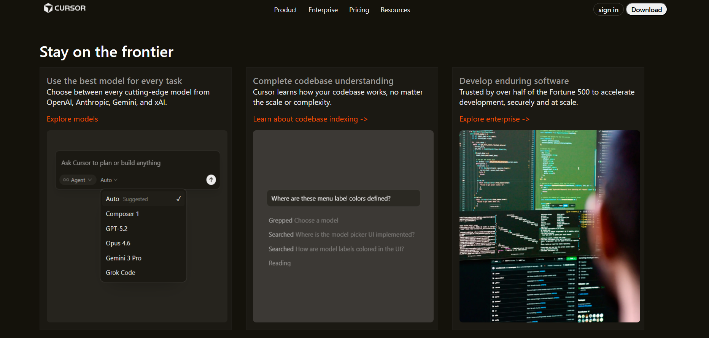
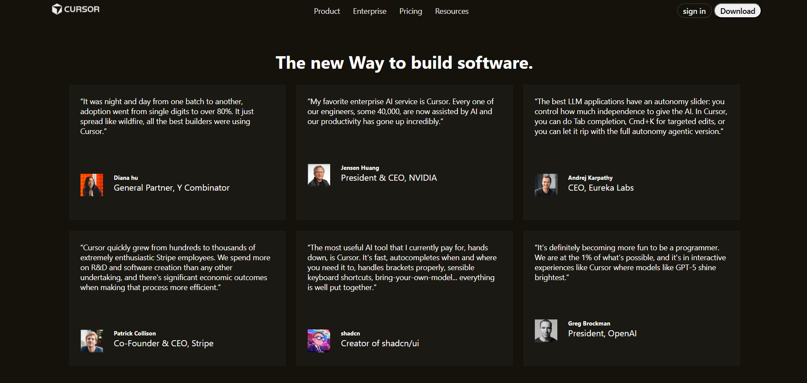
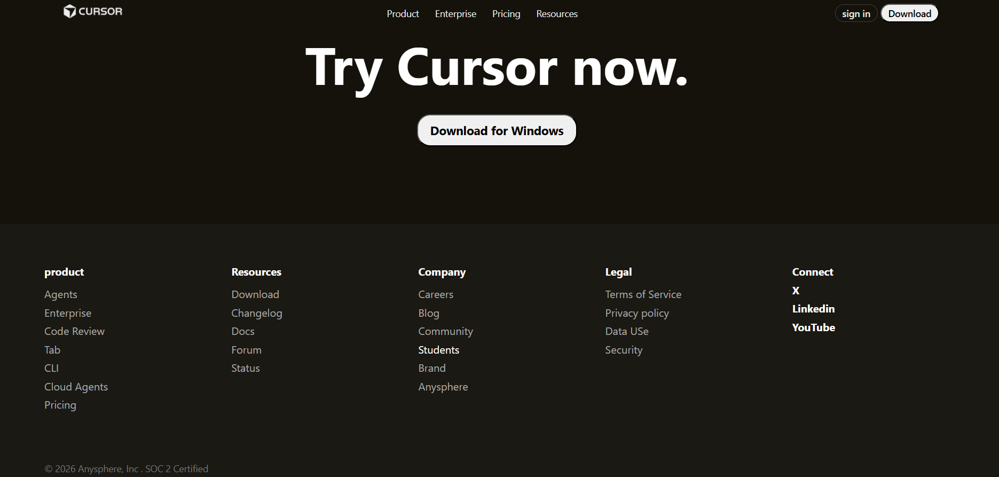

Cursor Website UI Clone

A static, desktop-first implementation of the Cursor landing page UI, built using only HTML and CSS as part of my Web Dev Cohort 2026.

This project emphasizes layout engineering over visual effects, focusing on recreating the structural layout, visual hierarchy, and section flow of a modern SaaS product website without using JavaScript, frameworks, or UI libraries.

Live Deployment

Production build deployed on Vercel:
🔗 https://cursor-ui-clone-flax.vercel.app/

Problem Statement

Recreate the Cursor marketing website UI with focus on:

Desktop-first layout

Section-based content flow

Visual hierarchy and spacing

Modern SaaS landing page patterns

Clean typography system

While maintaining the following constraints:

No JavaScript

No CSS frameworks (Tailwind, Bootstrap, etc.)

No animations or transitions

No responsive design (desktop only)

Pure HTML & CSS only

Solution Approach

The project was implemented by analyzing the original Cursor website and breaking it down into reusable layout patterns such as:

Hero sections with dual-column layouts

Feature blocks with text + illustration pairing

Card-based UI sections

Social proof / testimonial grids

Call-to-action sections

Multi-column footer system

A simple design system was defined to ensure consistent spacing, alignment, and visual rhythm across all sections.

Implemented Sections

The following major sections were recreated:

Top Navigation Bar

Hero Section

Feature Highlights

AI Tools Section

Workflow / Productivity Section

Social Proof / Tweets Section

Call-To-Action

Footer

Each section follows a consistent layout structure and spacing model.

Tech Stack

HTML5 (Semantic Markup)

CSS3

Flexbox for one-dimensional layouts

CSS Grid for complex card systems

Deployed using Vercel

No external libraries or frameworks were used.

Design System
Typography

System font stack + Inter-style sans-serif

Layout Rules

Desktop-first container system

Max content width: 1200px

Large vertical spacing for readability

Section-based layout approach

Styling Principles

Minimal color palette

High contrast text

Focus on readability over decoration

Project Structure
CURSOR-UI-CLONE/
│
├── assets/
│   ├── illustrations/   # Hero and feature visuals
│   ├── logos/           # Brand assets
│   └── ui/              # UI images and avatars
│
├── screenshots/         # Project screenshots
│   ├── home.png
│   ├── feature.png
│   ├── feature1.png
│   ├── tweets.png
│   └── footer.png
│
├── index.html
├── style.css
└── README.md

Assets are grouped by semantic purpose rather than file type to improve maintainability.

Screenshots
### Homepage

### Feature Section 1

### Feature Section

### Social Proof

### Footer

Key Learnings

Through this project, the following skills were strengthened:

Translating real SaaS designs into structured HTML

Building scalable layout systems using Flexbox and Grid

Managing assets in a clean project architecture

Writing professional technical documentation

Deploying static frontend projects to production

Limitations

This project intentionally does not include:

JavaScript functionality

Responsive layouts

Accessibility optimizations

Animations or micro-interactions

The focus was strictly on layout engineering and structural accuracy.

Future Improvements

Add responsive layouts for tablet and mobile

Introduce basic interactivity with JavaScript

Improve accessibility (ARIA roles, keyboard navigation)

Add subtle transitions and animations

Acknowledgements

This project is inspired by the design and layout patterns of the official Cursor website.
All content and assets are used for educational purposes only.

Built with focus on layout accuracy, not pixel perfection.

Author

Tejas
Web Development Student
Learning MERN & GenAI